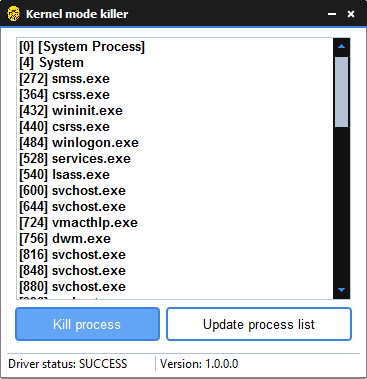

# __K3rn3LM0d3_killer__

**Simple process killer from kernel-mode-driver with GUI**.

---

## Screenshot



---

### Installation :)

1. Open CMD with admin-rights and enter commands:

2. bcdedit.exe -set loadoptions DDISABLE_INTEGRITY_CHECKS

3. bcdedit.exe -set TESTSIGNING ON (OFF to remove)

4. Reboot PC

5. Drop ```keM0de_killer.sys``` file to C: drive.

6. Run ```KernelModeKiller.exe``` with admin-rights.

---

## Coded by

    ♥Shan0x228
[YouTube channel](https://www.youtube.com/channel/UCmJT3IfHtpFJyln2UdABBKg)    